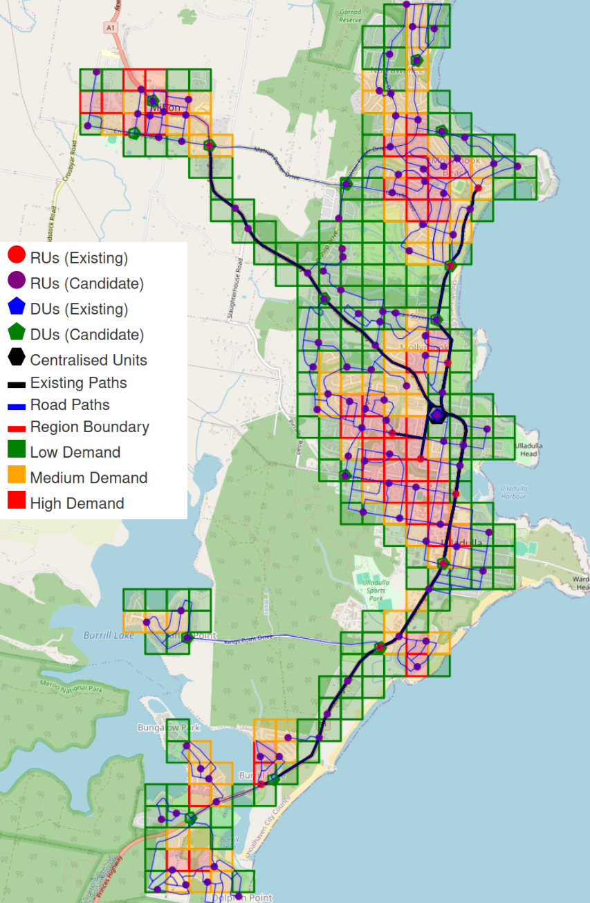
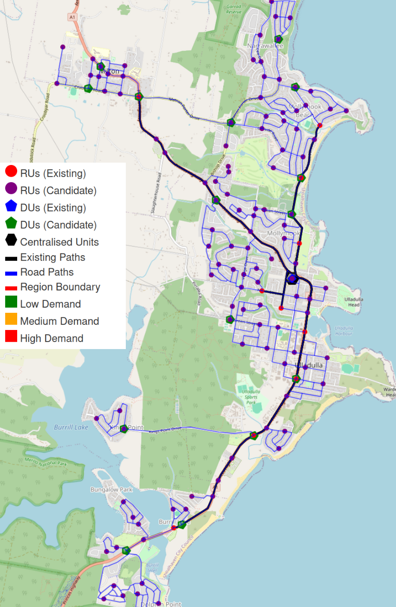
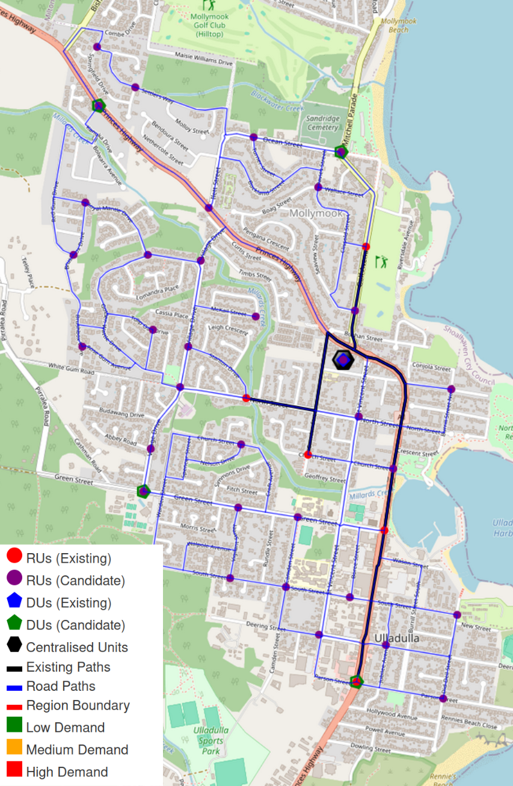

# Dataset Overview

This directory contains the datasets used for network modeling and experimentation. Two versions are provided: a **Full Dataset** and a **Small Dataset**. Both share the same structure and file types but differ in scale and complexity.  

> 📂 **[dataset](.)/** — *Input datasets for experiments*
>
> - 📁 [full-dataset](full-dataset)/ — *Large-scale dataset for full experiments & performance evaluation*
> - 📁 [small-dataset](small-dataset)/ — *Lightweight dataset for debugging & quick tests*
> - 📄 [README.md](README.md) — *Documentation of dataset format & usage*

---

## File Overview

Each dataset contains the following files:

- **`centralised_units.json`** – Centralised Unit (CU) information.  
- **`distributed_units.json`**, **`distributed_units_exist.json`**, **`distributed_units_new.json`** – Distributed Unit (DU) details, distinguishing between existing and newly deployed units.  
- **`du_cu_path.json`**, **`du_cu_path_exist.json`**, **`du_cu_path_new.json`**, **`ru_du_path.json`**, **`ru_du_path_exist.json`**, **`ru_du_path_new.json`** – Path data between network components.  
- **`radio_units.json`**, **`radio_units_exist.json`**, **`radio_units_new.json`** – Radio Unit (RU) details, separated into existing and new devices.  
- **`region.json`** – Region definition.  
- **`road_distances.json`**, **`road_edges.json`**, **`road_nodes.json`** – Road network data used for connectivity modeling.  
- **`user_map.json`** – Mapping of users to available Radio Units (RUs) and coverage areas.  
- **`demand_points.json`** - Contains the grid of demand points for the network, which are used to simulate user demand and coverage requirements.
- **`ru_du_existing_mappings.json`** – Mapping of existing RUs to existing DUs, used for scenarios with pre-deployed infrastructure.

### Existing vs New Devices

For both **Distributed Units (DUs)** and **Radio Units (RUs)**, the dataset separates **existing** devices from **new** devices:  

- Existing devices typically carry different cost parameters.  
- New devices model potential deployments.  
- To simulate a **greenfield deployment**, move all devices from the "existing" files into the "new" files, treating the scenario as if no infrastructure is already in place.  

---

## Modifying Dataset Parameters

The JSON files can be edited to explore different network configurations and scenarios:

- **Radio Units (RUs):**
  - **Coverage radius**
  - **Capacity bandwidth**
  - **Location** (move, add, or remove RUs)

    If you change the coverage radius or RU locations, you must regenerate the **user map** to ensure user-to-RU assignments are accurate. Use the helper script [`make_user_mapping.py`](../scripts/make_user_mapping.py) for this purpose.

    Note: Adjusting coverage radius or RU placement may result in some coverage targets becoming unattainable. You can modify the required coverage percentage in the `config.py` file, where all dataset parameters are defined.

- **Distributed Units (DUs):**
  - Capacity bandwidth
  - Capacity ports
  - Location (move, add, or remove DUs)

When you add, remove, or relocate RUs or DUs, you also need to rebuild shortest paths for network connectivity. Use the script [`build_all_paths.py`](../scripts/build_all_paths.py) to update all path files accordingly.

- **RU-DU Existing Mapping:**
  - The file **`ru_du_existing_mapping.json`** defines the mapping between existing RUs and existing DUs for scenarios with pre-deployed infrastructure.
  - If you have multiple existing DUs, each existing RU should be mapped to only one DU in this file. This ensures clear assignment and avoids ambiguity in network topology.
  - Edit **`ru_du_existing_mapping.json`** to reflect your desired existing RU-to-DU relationships for different scenarios.

These modifications enable experiments with varying network densities, user demands, and deployment strategies.

## Full Dataset

Path: **`full-dataset/`**

The full dataset provides comprehensive data for large-scale network modeling. It contains detailed information on all network components, supporting both mixed (existing + new) and greenfield scenarios.

<table>
  <tr>
    <td align="center">
       
      <strong>Full Dataset with user grid</strong>
    </td>
    <td align="center">
       
      <strong>Full Dataset</strong>
    </td>
  </tr>
</table>

---

## Small Dataset

Path: **`small-dataset/`**

The small dataset is a scaled-down version of the full dataset, designed for:

- Quick testing
- Debugging
- Development and validation runs

It shares the same file structure, including separate files for **existing** and **new** devices, but contains fewer entries for faster processing and easier debugging.

   
  <strong>Small Dataset</strong>

---

## Usage

1. Choose the dataset appropriate for your needs:

   - **Full Dataset** for large-scale, detailed experiments.
   - **Small Dataset** for rapid iteration or debugging.

2. Modify parameters within the dataset files to explore different deployment and capacity scenarios.

3. If changes are made to **RU coverage radii**, regenerate the `user_map.json` using the provided script (see above).
